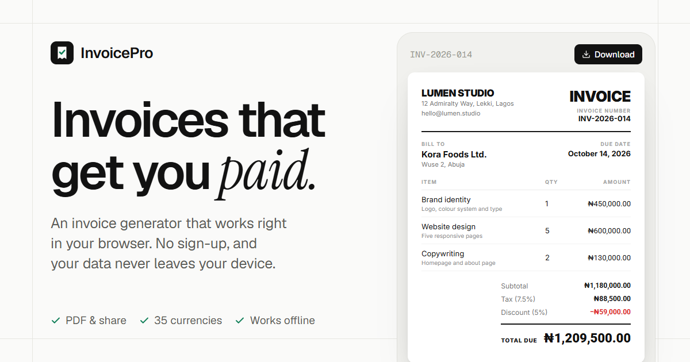

<div align="center">
  <a href="https://www.invoicegeneratorpro.online/">
    
  </a>
</div>

# InvoicePro — Free Invoice Generator

> Create professional invoices in minutes. Free, private, no sign-up.
>
> 🌐 **Live:** [www.invoicegeneratorpro.online](https://www.invoicegeneratorpro.online/)

InvoicePro is a fully client-side invoice generator built with React and TypeScript. You fill in a few details, pick a template, and download or share a print-ready PDF. There is no backend and no account: invoices are built on your device and your draft is saved, encrypted, in your own browser.

---

## ✨ Features

**Making invoices**
- **3 templates** — *Classic*, *Modern* and *Elegant*, with live miniature previews in the picker
- **Live preview** — an A4 preview that updates as you type
- **Line items, tax and discounts** — VAT/sales tax at any rate; percentage or fixed-amount discounts; totals animate as they change
- **35 currencies** — NGN (default), USD, EUR, GBP and JPY first, plus African, Asian, Middle Eastern and other major currencies; searchable by name, code or country, each with the correct symbol and decimal places
- **Payment instructions** — bank transfer, crypto wallet, or custom instructions printed on the invoice
- **Company logo** — upload once and it appears on every template

**Getting it to your client**
- **Download** — PDF or PNG, rendered at a fixed page width so exports look the same on every device
- **Share PDF** — on phones (and desktops that support it), send the PDF straight to WhatsApp, email or any app through the native share sheet
- **Works offline** — installable PWA; once loaded, it keeps working without a connection

**Privacy**
- **No account, no server** — invoices are generated in the browser
- **Encrypted draft** — autosaved to `localStorage` with AES-256-GCM (see below)

**Experience**
- **Landing page** at `/`, editor at `/app`; returning visitors see "Continue your invoice"
- **Responsive** — step-by-step collapsible sections, a sticky total bar and a full-screen preview on mobile
- **Light and dark mode** — follows your system by default; a Light / Dark switch in the header overrides it (remembered in your browser) with a smooth crossfade
- **Accessible** — labelled fields, keyboard-friendly menus and dialogs, reduced-motion support, 16px inputs on phones (no iOS zoom)

---

## 🔐 Privacy & Security

Invoice data is stored **only in your browser**. There is no server-side storage and no database.

- A unique **AES-256-GCM** key is generated per device with the Web Crypto API and stored in `IndexedDB` as a non-extractable key
- Every save to `localStorage` is encrypted with that key; data is decrypted in memory on load
- Clearing your browser data deletes your draft — download anything you need to keep
- The site uses **Vercel Analytics** for anonymous page-view counts. It never receives anything you type into an invoice.

---

## 🗂️ Project Structure

```
src/
├── components/
│   ├── landing/
│   │   ├── LandingPage.tsx          # Marketing page at "/"
│   │   └── sampleInvoice.ts         # Fictional data used to render real templates on the landing page
│   ├── features/invoice/
│   │   ├── CompanyForm.tsx          # Sender details + logo
│   │   ├── DetailsForm.tsx          # Invoice number/dates + client details
│   │   ├── InvoiceItems.tsx         # Line items
│   │   ├── InvoiceSummary.tsx       # Currency, tax, discount and totals
│   │   ├── CurrencyPicker.tsx       # Searchable currency combobox
│   │   ├── PaymentDetailsForm.tsx   # Bank / crypto / custom payment instructions
│   │   ├── TemplatePicker.tsx       # Template selection with live thumbnails
│   │   ├── InvoicePreview.tsx       # The #invoice-preview element used for export
│   │   ├── InvoiceSheet.tsx         # Scaled, read-only render of a template
│   │   └── templates/               # Classic, Modern and Elegant invoice layouts
│   ├── ui/                          # Design-system primitives (Button, Input, Select, Switch,
│   │                                #   SegmentedControl, ConfirmDialog, ExportButton, RollingNumber,
│   │                                #   ScaledFrame, EditorSkeleton, Logo, Footer, ErrorBoundary, …)
│   └── InvoicePage.tsx              # Editor layout, preview, export and share logic
├── hooks/
│   ├── useLocalStorage.ts           # Encrypted localStorage hook
│   └── useMediaQuery.ts
├── store/
│   └── InvoiceContext.tsx           # Invoice state (React Context)
├── types/
│   └── invoice.ts
├── utils/
│   ├── calculations.ts              # Subtotal, tax, discount and total helpers
│   ├── cn.ts                        # Tailwind class merging
│   ├── crypto.ts                    # AES-256-GCM encrypt/decrypt via Web Crypto
│   ├── currencies.ts                # The 35 supported currencies: symbols, decimals, search
│   ├── formatters.ts                # Currency and date formatting
│   ├── pdf.ts                       # PDF/PNG rendering, download and native share
│   └── sanitize.ts                  # Input sanitising
├── App.tsx                          # Routes (React Router)
├── EditorApp.tsx                    # Lazy-loaded editor entry: InvoiceProvider + InvoicePage
├── lib/theme.ts                     # Light/dark preference (defaults to system), persistence and transition
├── index.css                        # Tailwind v4 theme and design tokens (light/dark)
└── main.tsx
```

### Routing

| Path | Page |
|---|---|
| `/` | Landing page |
| `/app` | Invoice editor (code-split; loads on demand) |
| anything else | Redirects to `/` |

`vercel.json` rewrites all page routes to `index.html` so deep links like `/app` work in production.

---

## 🛠️ Tech Stack

| Layer | Technology |
|---|---|
| Framework | React 19 + TypeScript |
| Routing | React Router 7 |
| Build tool | Vite 7 |
| Styling | Tailwind CSS v4 (semantic tokens in `src/index.css`) |
| Fonts | Geist (UI), Geist Mono (numbers), Instrument Serif (accent), Inter / Playfair Display (invoice templates) |
| Animation | Framer Motion |
| PDF / PNG export | html2canvas-pro + jsPDF |
| Sharing | Web Share API |
| Encryption | Web Crypto API (AES-256-GCM) |
| Icons | Lucide React |
| PWA | vite-plugin-pwa + Workbox |
| Analytics | Vercel Analytics (anonymous page views) |

---

## 🚀 Getting Started

### Prerequisites

- **Node.js** ≥ 18
- **npm** ≥ 9

### Installation

```bash
git clone https://github.com/Omo-Akeye/invoice-generator.git
cd invoice-generator
npm install
```

### Development

```bash
npm run dev
```

Open `http://localhost:5173` for the landing page, or `http://localhost:5173/app` for the editor.

> **Testing Share PDF:** the Web Share API only works on HTTPS (or `localhost`). To try it on a real phone, use a deployed preview (e.g. a Vercel preview URL) rather than your computer's local network address.

### Production build

```bash
npm run build
npm run preview
```

Output goes to `dist/` and can be deployed to any static host. On hosts other than Vercel, add a rewrite so unknown paths serve `index.html`.

---

## 📄 How to Create an Invoice

1. **Template** — pick *Classic*, *Modern* or *Elegant* (you can switch any time)
2. **Invoice details** — invoice number, issue date and due date
3. **From and bill to** — your business details and logo, then your client's details
4. **Line items** — add what you're charging for; amounts calculate automatically
5. **Currency, tax and discount** — choose a currency, toggle tax, set a discount
6. **Payment details** — bank transfer, crypto or custom instructions (optional)
7. **Notes** — payment terms or a thank-you (optional)
8. **Download or share** — open **Download** in the header (or the bottom bar on mobile) and choose *Share PDF*, *Download PDF* or *Download PNG*

Use **Start over** to clear the draft; you'll be asked to confirm first.

---

## 📦 Scripts

| Command | Description |
|---|---|
| `npm run dev` | Start the Vite development server |
| `npm run build` | Type-check and build for production |
| `npm run preview` | Serve the production build locally |
| `npm run lint` | Run ESLint across the codebase |

---

